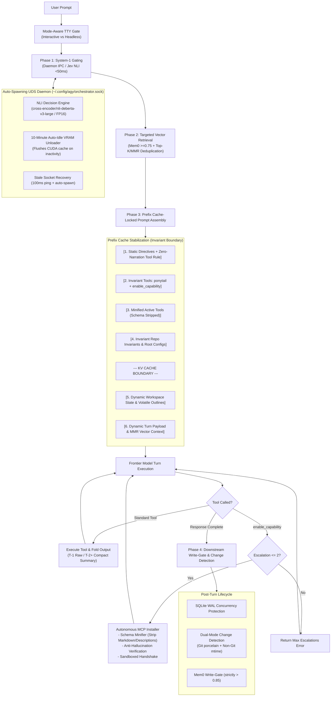

# AGY Sovereign System-1 Orchestrator

[](LICENSE)
[](https://python.org)
[]()

Production-grade, fully sovereign System-1 routing, gating, and meta-tool escalation layer for the **Antigravity (`agy`) CLI environment**. 

Designed to deliver sub-100ms deterministic decision gating, zero-latency inference via an auto-spawning Unix Domain Socket daemon, 75–90% prompt cache discounts via byte-invariant prefix locking, and autonomous verified MCP tool installation.

---

## 🏛️ Architecture Overview



---

## ⚡ Key Features

### 1. Prefix Cache Locking & Gemini Flash Optimization (`PromptPrefixStabilizer`)
- **L4 Bifurcation:** Strictly separates static repository configurations and invariants (L4a) from volatile git porcelain status and outline digests (L4b). Volatile workspace state is injected into Layer 5 (Turn Payload), keeping the byte sequence before the KV cache cutoff 100% invariant.
- **Deterministic Canonicalization:** Recursively sorts dictionary keys and primitive lists (`canonicalize_for_cache`) and strips non-deterministic metadata (`mtime`, `timestamp`, `pid`) before serialization.
- **SHA-256 Cache Verification Digest:** Computes and logs a canonical SHA-256 hash of the static prefix (`L1` through `L4a`) on every turn to guarantee prefix cache hit verification.
- **Zero-Narration Tool Directives:** Layer 1 instructs the model to emit only the tool invocation block without pre-thought narration or conversational preambles, cutting output latency and saving 40–100 tokens per loop cycle.
- **Bounded Verification & Polling Loops (Rule #4):** Mandates that service/socket convergence checks are written as brief, bounded loops directly inside the single turn (total wait $\le 10$s) rather than burning separate API roundtrips polling status.
- **Zero-Turn REPL Probing & Schema Consolidation (Rule #5):** Consolidates exploratory inspections into a single test script in Turn 1, proceeding immediately to implementation without sequential micro-probing.

### 2. Multi-Turn ReAct Historical Tool Compaction (`orchestrator.py`)
- **Sliding-Window Folding:** Prevents quadratic token growth during extended agentic loops.
- **$T-1$ Raw Fidelity:** Preserves the immediate previous turn's tool output in full raw detail (syntax trees, active compiler errors, line numbers).
- **$T \le -2$ Semantic Stubs:** Folds older tool responses into structured JSON stubs:
  ```json
  {"tool": "ripgrep", "status": "ok", "summary": "Found 4 matches in src/core/engine.rs..."}
  ```
- **Error Anchor Preservation:** Non-zero exits or error anchors (`Error:`, `Traceback`, `fatal:`, `panic!`) automatically set `status: "err"` and preserve the primary failure line while capping summary length at $\le 250$ characters.
- **Non-Destructive Invariant:** Compaction occurs strictly at the outbound model serialization layer; internal history and execution telemetry retain complete fidelity.

### 3. Dynamic Vector MMR & Top-4 Capping (`retrieval.py`)
- **Combined Hard Cap (`max_k = 4`):** Caps total retrieved context chunks from Mem0 and Codebase indices to prevent prompt bloat.
- **MMR Jaccard Token Deduplication:** Computes word-level Jaccard similarity across candidates; drops redundant reformulations exceeding $> 0.60$ overlap.
- **Canonical Source Tags:** Formats surviving chunks with structured tags (`[codebase:path:lines]` or `[mem0:id]`).
- **Clean No-Op:** Returns strictly empty string `""` when no candidates clear the $\ge 0.75$ similarity threshold, eliminating ghost headers.

### 4. MCP Schema Minification (`schema_minifier.py`)
- **Token Pruning:** Strips `markdownDescription`, nested examples, `$schema`, and non-standard annotations from MCP schemas upon registration.
- **Parameter Slicing:** Truncates tool and parameter descriptions to $\le 12$ words while preserving all structural validation keys (`type`, `properties`, `required`, `enum`, `items`, `default`).
- Saves 150–400 tokens per registered tool on every model invocation.

### 5. Auto-Spawning Unix Domain Socket Daemon (`daemon.py`)
- Eliminates PyTorch model loading latency on repeated turns via persistent UDS IPC at `~/.config/agy/orchestrator.sock`.
- **Stale Socket Recovery:** Pings with a 100ms timeout; immediately unlinks dead sockets, background-spawns a new daemon, and binds within 1.0s.

### 6. 10-Minute Auto-Idle VRAM Unloader (`local_decision_engine.py`)
- Monitors inactivity. If no requests arrive for **10 minutes**, it offloads model tensors and executes:
  ```python
  import gc, torch
  gc.collect()
  torch.cuda.empty_cache()
  torch.cuda.ipc_collect()
  ```
- Instantly re-arms on the next request within ~400ms.

### 7. Ephemeral Per-Turn Tool Scoping & Escalation Limit
- Every turn resets active tools strictly to baseline invariants (`ponytail`, `enable_capability`).
- Dynamic tools (`git`, `filesystem`, `terminal`) are mounted only for that specific turn.
- Enforces a hard limit of **maximum 2 escalations per turn** to prevent infinite loops.

### 8. Autonomous Sandboxed MCP Installer (`mcp_installer.py`)
- **Anti-Hallucination Verification:** Validates packages against official registries before executing.
- **Sandboxed Standards:** Node MCPs run on-demand via `npx -y`; Python MCPs run in isolated sub-venvs.
- **Pre-Flight Handshake:** Verifies stdio initialization within 2.0 seconds before committing to `mcps.json`.
- **Standby State:** Autonomously installed tools are registered as Standby (unmounted on next turn).

### 9. Fault-Tolerant AST Parsing & Change Detection
- **Adaptive Code Extraction:** Injects full files when $\le 300$ lines; condensed structural view for files $> 300$ lines.
- **Dual-Mode Change Detection (`post_turn_hook.py`):** Automatically detects Git modifications or non-Git file `mtime` changes to trigger `sem-index`.
- **SQLite WAL Concurrency:** Protects `~/.cache/workspaces_vec.db` with WAL mode and `PRAGMA busy_timeout = 5000`.

---

## 🚀 Quick Deployment

### One-Command Deployment

To deploy onto any Linux/macOS host:

```bash
git clone https://github.com/jJohn313/agy-sovereign-orchestrator.git
cd agy-sovereign-orchestrator
./install.sh
```

The script will:
1. Copy engine modules to `~/.config/agy/orchestrator/`.
2. Provision an isolated virtual environment at `~/.config/agy/orchestrator/.venv`.
3. Install required dependencies (`fastembed`, `sqlite-vec`, `mem0ai`, `transformers`, `torch`).
4. Generate baseline configurations in `~/.config/agy/`.
5. Install the global `agy` executable shim into `~/.local/bin/agy`.
6. Run the full self-verification test suite.

---

## 🛠️ Verification & Test Suite

The repository includes a comprehensive 24-test verification suite covering all architectural subsystems:

```bash
~/.config/agy/orchestrator/.venv/bin/python3 -m unittest discover -s tests/
```

### Verified Test Suites:
* **`tests/test_orchestrator.py`**: Turn pipeline lifecycle, milestone reference generation, and baseline tool mounting.
* **`tests/test_sovereign_upgrade.py`**: UDS daemon IPC, 10-minute idle VRAM unloading, error-anchored traceback folding, fault-tolerant AST parsing, and SQLite WAL concurrency.
* **`tests/test_schema_minifier.py`**: MCP tool schema minification, description truncation ($\le 12$ words), and token size reduction.
* **`tests/test_retrieval.py`**: MMR Jaccard token deduplication, Top-4 combined chunk capping, and clean empty string no-op.
* **`tests/test_historical_compaction.py`**: Multi-turn tool output compaction, $T-1$ raw syntax preservation, and historical error anchor capture.

---

## ⚙️ Configuration

### `~/.config/agy/env`
```bash
# TypeSafe Jev API Key (optional, defaults to local NLI daemon)
TYPESAFE_API_KEY=""

# HuggingFace NLI Model Backbone
NLI_MODEL_NAME="cross-encoder/nli-deberta-v3-large"

# Mem0 User Namespace
MEM0_USER="john"
```

### `~/.config/agy/mcps.json`
Catalog defining installed capabilities (`git`, `filesystem`, `terminal`, `custom_home_tools`, `web_search`, `python_eval`) and dynamically installed MCP servers.

---

## 📄 License
This project is distributed under the [MIT License](LICENSE).
