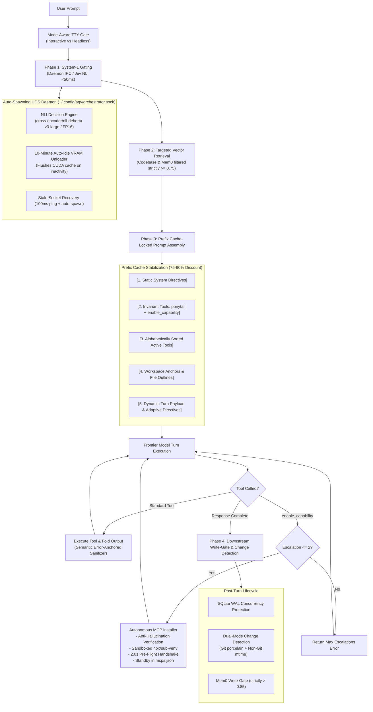

# AGY Sovereign System-1 Orchestrator

[](LICENSE)
[](https://python.org)
[]()

Production-grade, fully sovereign System-1 routing, gating, and meta-tool escalation layer for the **Antigravity (`agy`) CLI environment**. 

Designed to deliver sub-100ms deterministic decision gating, zero-latency inference via an auto-spawning Unix Domain Socket daemon, 75–90% prompt cache discounts via prefix locking, and autonomous verified MCP tool installation.

---

## 🏛️ Architecture Overview



---

## ⚡ Key Features

1. **Auto-Spawning Unix Domain Socket Daemon (`daemon.py`):**
   - Eliminates PyTorch model loading latency on repeated turns via persistent UDS IPC at `~/.config/agy/orchestrator.sock`.
   - **Stale Socket Recovery:** Pings with a 100ms timeout; immediately unlinks dead sockets, background-spawns a new daemon, and binds within 1.0s.

2. **10-Minute Auto-Idle VRAM Unloader (`local_decision_engine.py`):**
   - Monitors inactivity. If no requests arrive for **10 minutes**, it offloads model tensors and executes:
     ```python
     import gc, torch
     gc.collect()
     torch.cuda.empty_cache()
     torch.cuda.ipc_collect()
     ```
   - Instantly re-arms on the next request within ~400ms.

3. **Prefix Cache Locking (`orchestrator.py`):**
   - Assembles prompt layers in strict deterministic order to secure **75–90% prompt cache discounts** on frontier model APIs.
   - Alphabetically sorts dynamic tool definitions and preserves invariant tool positions (`ponytail`, `enable_capability`).

4. **Ephemeral Per-Turn Tool Scoping & Escalation Limit:**
   - Every turn resets active tools strictly to baseline invariants.
   - Dynamic tools (`git`, `filesystem`, `terminal`) exist only for that specific turn.
   - Enforces a hard limit of **maximum 2 escalations per turn** to prevent recursion.

5. **Autonomous Sandboxed MCP Installer (`mcp_installer.py`):**
   - **Anti-Hallucination Verification:** Validates packages against official registries before executing.
   - **Sandboxed Standards:** Node MCPs run on-demand via `npx -y`; Python MCPs run in isolated sub-venvs.
   - **Pre-Flight Handshake:** Verifies stdio initialization within 2.0 seconds before committing to `mcps.json`.
   - **Standby State:** Autonomously installed tools are registered as Standby (unmounted on next turn).

6. **Semantic Error-Anchored Log Folding (`sanitizer.py`):**
   - Never chops out the root cause of an error. Detects critical error anchors (`Error:`, `FAILED`, `Exception:`, `panic!`, `assert`, `Traceback:`) and preserves lines $L-5 \dots L+25$ while collapsing setup noise.

7. **Fault-Tolerant AST Parsing (`retrieval.py`):**
   - Injects full files when $\le 300$ lines; injects structural outlines for files $> 300$ lines.
   - Robust `ast.parse()` automatically falls back to regex-based structural extraction if active edits introduce syntax errors.

8. **Dual-Mode Workspace Change Detection & SQLite WAL (`post_turn_hook.py`):**
   - Automatically detects Git modifications or non-Git file `mtime` changes to trigger `sem-index`.
   - Protects `~/.cache/workspaces_vec.db` with `PRAGMA journal_mode = WAL` and `PRAGMA busy_timeout = 5000` to prevent `database is locked` errors.

---

## 🚀 Quick Deployment

### One-Command Deployment

To deploy onto any Linux/macOS host:

```bash
git clone https://github.com/jJohn313/agy-sovereign-orchestrator.git
cd agy-sovereign-orchestrator
./install.sh
```

The script will:
1. Copy modules to `~/.config/agy/orchestrator/`.
2. Provision an isolated virtual environment at `~/.config/agy/orchestrator/.venv`.
3. Install required dependencies (`fastembed`, `sqlite-vec`, `mem0ai`, `transformers`, `torch`).
4. Generate baseline configurations in `~/.config/agy/`.
5. Install the global `agy` executable shim into `~/.local/bin/agy`.
6. Run the full self-verification test suite.

---

## 🛠️ Verification & Test Suite

The repository includes a 7-test verification suite covering all system dimensions:

```bash
~/.config/agy/orchestrator/.venv/bin/python3 -m unittest discover -s tests/
```

### Verified Test Dimensions:
* `test_1_daemon_ping_and_stale_socket`: Dead socket unlinking and auto-spawn recovery.
* `test_2_idle_timeout_vram_unloader`: 10-minute idle timer CUDA cache release.
* `test_3_traceback_anchor_log_folding`: Error-anchored traceback window preservation.
* `test_4_fault_tolerant_ast`: Regex outline fallback for syntax-broken code.
* `test_5_ephemeral_reset_and_autonomous_mcp_install`: Turn baseline reset and sandboxed MCP registration.
* `test_6_sqlite_wal_and_concurrency`: Concurrent WAL mode on vector databases.
* `test_7_end_to_end_non_git_workspace`: Non-Git `mtime` modification detection.

---

## ⚙️ Configuration

### `~/.config/agy/env`
```bash
# TypeSafe Jev API Key (optional, defaults to local NLI daemon)
TYPESAFE_API_KEY=""

# HuggingFace NLI Model Backbone
NLI_MODEL_NAME="cross-encoder/nli-deberta-v3-large"

# Mem0 User Namespace
MEM0_USER="john"
```

### `~/.config/agy/mcps.json`
Catalog defining installed capabilities (`git`, `filesystem`, `terminal`, `custom_home_tools`, `web_search`, `python_eval`) and dynamically installed MCP servers.

---

## 📄 License
This project is distributed under the [MIT License](LICENSE).
